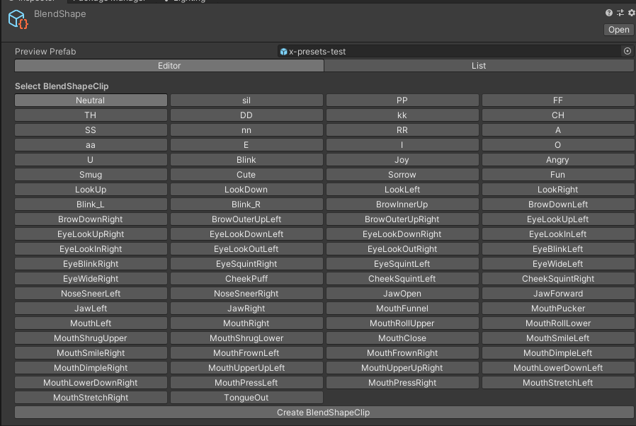

# Blank Presets for Univrm

I was frustrated at how much time I was spending going through setting up my presets on models. It's a lot. There's work involved.
So I picked apart the c# code that controls it in Univrm 0.92.0_02487, and added the ones I use all the time. So, all of the visemes, as well as the arkit shapes.

This is just the blank presets. With this, I'm assuming you've already created the shapekeys and morphs you need to make these mixes

Here's the list:

## Instructions

Everything below assets belongs in your project. Drop it in. Let it overwrite things. Be good to each other
